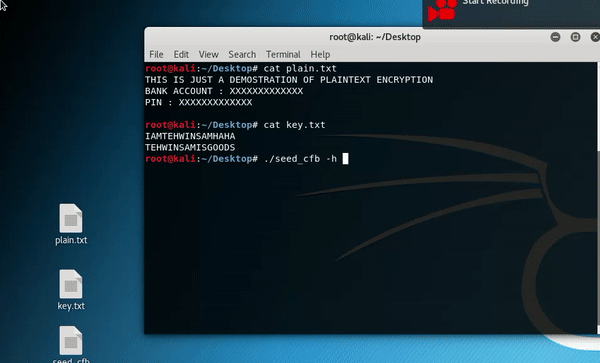

# CryptoAssignment2 | Block Cipher using Seed Encryption 
Sample usage

How it encrypt and decrypt .txt file 

How it encrypt and decrypt .pdf 

git clone https://github.com/Applebois/CryptoAssignment2/

cd CryptoAssignment2

cd Output

chmod u+x seed_cfb

./seed_cfb -h 

Enjoy :)